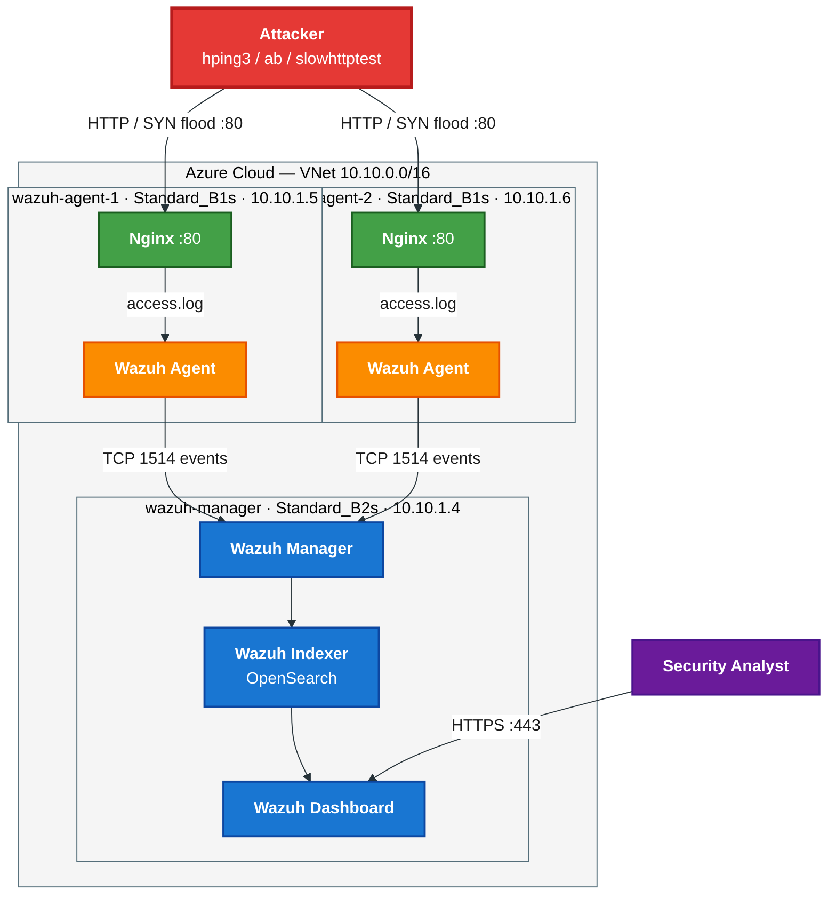
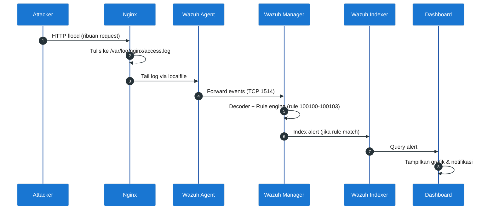
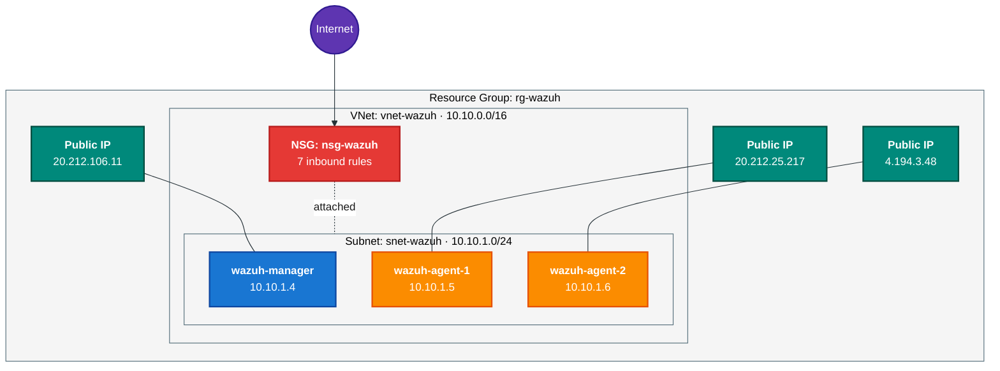
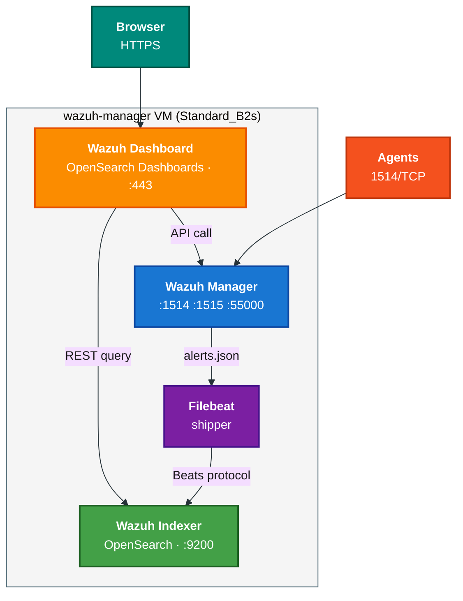
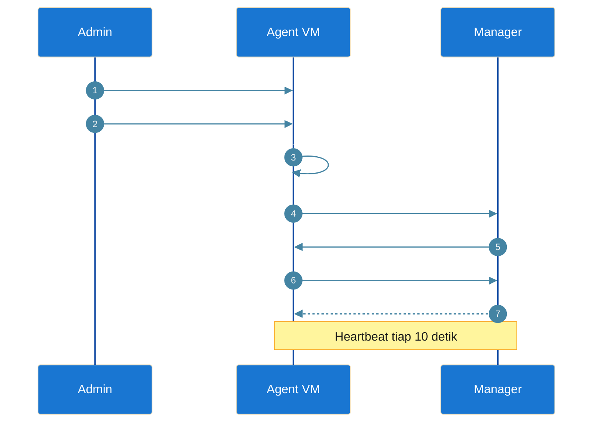
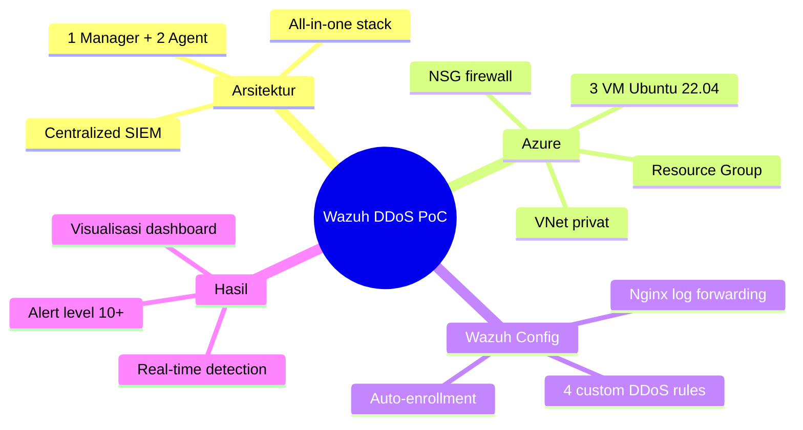

# SOC-WAZUH

## Anggota Tim Kelompok 9

| No | Nama                       | NRP        |
| -- | -------------------------- | ---------- |
| 1  | Mochamad Rizki Nasrullah   | 5027241038 |
| 2  | M Alfaeran Auriga Ruswandi | 5027241115 |
| 3  | S. Farhan Baig             | 5027241097 |

## 📖 Executive Summary

Project ini bertujuan membangun sistem monitoring keamanan terpusat yang mampu:

- Mengumpulkan log dari berbagai endpoint
- Melakukan korelasi event keamanan secara real-time
- Mendeteksi aktivitas anomali dan serangan DDoS
- Menampilkan visualisasi keamanan melalui dashboard
- Mendukung investigasi insiden menggunakan log dan GeoIP

Lingkungan pengujian menggunakan arsitektur 1 Wazuh Manager dan 2 Wazuh Agent yang memonitor layanan Nginx pada Azure Virtual Machine.

Panduan lengkap deploy arsitektur Wazuh (1 Manager + 2 Agent) di Azure Student Free Tier, lalu melakukan simulasi DDoS untuk menguji kemampuan deteksi SIEM.

---

## 🎯 Ringkasan Tugas

| # | Tahap | Output |
|---|-------|--------|
| 1 | Perencanaan & Desain Arsitektur | Diagram arsitektur |
| 2 | Deployment Azure Infrastructure | 3 VM aktif (1 Manager, 2 Agent) |
| 3 | Instalasi & Integrasi Wazuh | Dashboard menampilkan semua agent `Active` |
| 4 | Setup Target Service & Logging | Nginx + log diteruskan ke Wazuh |
| 5 | Simulasi DDoS (PoC) | Trafik flooding dari attacker VM |
| 6 | Detection & Alert Analysis | Screenshot alert + analisis |

---

## ✨ Key Features

### Security Monitoring

- Real-time log collection
- Centralized security monitoring
- Security event correlation
- GeoIP attacker attribution

### Detection Engine

- HTTP Flood Detection
- SYN Flood Detection
- Slowloris Detection
- SSH Brute Force Detection

### Visualization

- Security Dashboard
- Alert Analytics
- Event Timeline
- Severity Classification

### Infrastructure

- Microsoft Azure Cloud
- Wazuh SIEM
- OpenSearch Indexer
- Nginx Web Server

---

## 🏗️ Arsitektur Sistem

```
                     ┌──────────────────────────┐
                     │   Wazuh Manager + Dash   │
                     │   (VM-1, Ubuntu 22.04)   │
                     │   Port: 1514, 1515, 443  │
                     └────────────┬─────────────┘
                                  │
                ┌─────────────────┼─────────────────┐
                │                                   │
        ┌───────▼────────┐                  ┌───────▼────────┐
        │ Wazuh Agent 1  │                  │ Wazuh Agent 2  │
        │ (VM-2, Nginx)  │                  │ (VM-3, Nginx)  │
        │ Target service │                  │ Target service │
        └───────▲────────┘                  └───────▲────────┘
                │                                   │
                └──────────────┬────────────────────┘
                               │
                       ┌───────▼────────┐
                       │  Attacker VM   │
                       │ (hping3/locust)│
                       └────────────────┘
```

## 🎯 Security Objectives

Project ini dirancang untuk memenuhi beberapa tujuan keamanan berikut:

| Objective | Description |
|------------|------------|
| Visibility | Menyediakan visibilitas aktivitas jaringan dan server |
| Detection | Mendeteksi serangan secara real-time |
| Monitoring | Memantau kesehatan layanan dan endpoint |
| Investigation | Mendukung proses forensik digital |
| Response | Menyediakan informasi untuk mitigasi insiden |

---

**Spesifikasi VM (Free Tier friendly):**

| VM | Role | Size | OS | Disk |
|----|------|------|----|------|
| `wazuh-manager` | Manager + Indexer + Dashboard | Standard_B2s (2 vCPU, 4GB) | Ubuntu 22.04 LTS | 30 GB |
| `wazuh-agent-1` | Target Nginx | Standard_B1s (1 vCPU, 1GB) | Ubuntu 22.04 LTS | 30 GB |
| `wazuh-agent-2` | Target Nginx | Standard_B1s (1 vCPU, 1GB) | Ubuntu 22.04 LTS | 30 GB |
| `attacker` *(opsional, bisa dari laptop)* | Penyerang DDoS | Standard_B1s | Ubuntu 22.04 LTS | 30 GB |

> **Note:** Wazuh Manager butuh ≥ 4GB RAM. Kalau credit terbatas, jalankan VM hanya saat dipakai dan **stop (deallocate)** setelahnya.

---

## ✅ Prasyarat

- Akun Azure for Students aktif (https://azure.microsoft.com/free/students)
- Azure CLI ter-install lokal: `az --version`
- SSH key: `~/.ssh/id_rsa.pub` (kalau belum ada: `ssh-keygen -t rsa -b 4096`)
- Bash / WSL / Git Bash (untuk menjalankan script `.sh`)

---

## 🚀 Langkah Pengerjaan

### Step 1 — Login & Setup Azure

```bash
az login
az account show --query "{name:name, id:id}"
```

### Step 2 — Deploy Infrastruktur

```bash
chmod +x scripts/*.sh
./scripts/01-azure-deploy.sh
```

Script akan:
- Membuat Resource Group `rg-wazuh-poc`
- Membuat VNet + Subnet + NSG
- Provision 3 VM (manager + 2 agent)
- Membuka port: 22 (SSH), 80/443 (HTTP), 1514–1515 (Wazuh), 9200, 55000

Output akhir berupa file `inventory.txt` berisi public IP semua VM.

### Step 3 — Install Wazuh Manager

```bash
# SSH ke VM manager
ssh azureuser@20.212.106.11

# Di dalam VM, jalankan:
curl -sO https://raw.githubusercontent.com/yourrepo/scripts/02-install-wazuh-manager.sh
# atau copy script lokal:
scp scripts/02-install-wazuh-manager.sh azureuser@20.212.106.11:~
ssh azureuser@20.212.106.11 'sudo bash 02-install-wazuh-manager.sh'
```

Setelah selesai, akses dashboard:
```
https://20.212.106.11
user: admin
pass: (dicetak di akhir script)
```

### Step 4 — Install Wazuh Agent di VM Target

> **Catatan:** `MANAGER_IP` di sini adalah **private IP** dari VM manager (misalnya `10.0.0.4`), bukan public IP. Agent berkomunikasi dengan manager melalui VNet internal (port 1514/1515), sehingga gunakan private IP agar koneksi lebih stabil dan tidak bergantung pada NSG public.
```bash
# Ambil enrollment IP & password dari manager
MANAGER_IP=10.10.1.4

# Untuk tiap agent VM:
scp scripts/03-install-wazuh-agent.sh azureuser@20.212.25.217:~
ssh azureuser@20.212.25.217 "sudo MANAGER_IP=$MANAGER_IP AGENT_NAME=agent-01 bash 03-install-wazuh-agent.sh"
```
```bash
# Ambil enrollment IP & password dari manager
MANAGER_IP=10.10.1.4

# Untuk tiap agent VM:
scp scripts/03-install-wazuh-agent.sh azureuser@4.194.3.48:~
ssh azureuser@4.194.3.48 "sudo MANAGER_IP=$MANAGER_IP AGENT_NAME=agent-02 bash 03-install-wazuh-agent.sh"
```

Verifikasi di dashboard Wazuh → **Agents** → status harus `Active`.

### Step 5 — Setup Target Service (Nginx) & Logging

# Jalankan di KEDUA agent (agent-1 dan agent-2), karena keduanya jadi target Nginx

# Agent 1:
scp scripts/04-setup-target-service.sh azureuser@20.212.25.217:~

ssh azureuser@20.212.25.217 'sudo bash 04-setup-target-service.sh'

# Agent 2:
scp scripts/04-setup-target-service.sh azureuser@4.194.3.48:~

ssh azureuser@4.194.3.48 'sudo bash 04-setup-target-service.sh'
```

Script ini:
- Install Nginx
- Aktifkan log akses (`/var/log/nginx/access.log`)
- Tambahkan blok `<localfile>` ke `ossec.conf` agent supaya log Nginx ikut dikirim
- Restart agent

### Step 6 — Tambahkan Custom Rules DDoS di Manager

```bash
scp wazuh/local_rules.xml azureuser@20.212.106.11:~
ssh azureuser@20.212.106.11 'sudo cp ~/local_rules.xml /var/ossec/etc/rules/local_rules.xml && sudo systemctl restart wazuh-manager'
```

### Step 7 — Jalankan Simulasi DDoS (PoC)

```bash
# Dari attacker VM atau laptop:
TARGET=20.212.25.217 ./scripts/05-ddos-simulation.sh

TARGET=4.194.3.48  ./scripts/05-ddos-simulation.sh
```

Script menyediakan tiga mode:
1. **HTTP Flood** (`hping3` / `ab`)
2. **SYN Flood** (`hping3 --flood -S`)
3. **Slowloris** (`slowhttptest`)

---

## ⚔️ Attack Scenarios

### Scenario 1 — HTTP Flood

Tujuan:
Membanjiri web server menggunakan request HTTP dalam jumlah besar untuk menguji kemampuan deteksi Layer 7.

Tools:

- ApacheBench (ab)
- hping3

---

### Scenario 2 — SYN Flood

Tujuan:
Membanjiri target menggunakan SYN packet untuk mengganggu proses pembentukan koneksi TCP.

Tools:

- hping3

---

### Scenario 3 — Slowloris

Tujuan:
Mempertahankan banyak koneksi HTTP aktif secara bersamaan hingga resource server habis.

Tools:

- slowhttptest

---

### Scenario 4 — SSH Brute Force

Tujuan:
Mensimulasikan percobaan login berulang menggunakan username yang tidak valid.

Expected Detection:

- Rule 5710
- Authentication Failed Events

---

### Step 8 — Analisis Detection & Alert

```bash
ssh azureuser@20.212.106.11 'sudo bash' < scripts/06-analyze-alerts.sh
```

Atau manual di dashboard:
- **Modules → Security events** → filter `rule.groups: web|attack|ddos`
- **Discover** → query: `data.srcip: "<ATTACKER_IP>"`

---

## 📈 Detection Results

### DDoS Detection

Selama simulasi serangan, Wazuh berhasil:

- Mengidentifikasi lonjakan trafik abnormal
- Mengelompokkan event berdasarkan source IP
- Memicu custom DDoS rules
- Menampilkan alert secara real-time

### SSH Brute Force Detection

Wazuh berhasil:

- Mendeteksi percobaan login ilegal
- Mengidentifikasi username tidak valid
- Menghasilkan alert Rule 5710
- Menampilkan detail IP penyerang

### GeoIP Attribution

Sistem berhasil:

- Mengidentifikasi asal IP penyerang
- Memetakan lokasi geografis attacker
- Mendukung proses investigasi insiden

---

## 📁 Struktur Repo

```
.
├── README.md
├── scripts/
│   ├── 01-azure-deploy.sh
│   ├── 02-install-wazuh-manager.sh
│   ├── 03-install-wazuh-agent.sh
│   ├── 04-setup-target-service.sh
│   ├── 05-ddos-simulation.sh
│   ├── 06-analyze-alerts.sh
│   └── soar/                     # 🆕 SOAR automation
│       ├── 07-setup-active-response.sh
│       ├── 08-setup-discord-webhook.sh
│       └── 09-deploy-shuffle.sh
├── wazuh/
│   ├── local_rules.xml           # Custom rules DDoS
│   └── ossec-soar-snippet.xml    # Snippet config SOAR
└── docs/
    ├── architecture.md
    └── soar.md                   # 🆕 Panduan lengkap SOAR
```

---

## 🤖 SOAR (Security Orchestration, Automation, Response)

Setelah PoC dasar berjalan, lanjut ke fitur otomasi response. Lihat **[docs/soar.md](docs/soar.md)** untuk panduan lengkap.

Quick start:
```bash
# Layer 1: auto-block IP attacker via iptables
ssh azureuser@<MANAGER_IP> 'sudo bash' < scripts/soar/07-setup-active-response.sh

# Layer 2: notif Discord (siapkan webhook URL dulu)
ssh azureuser@<MANAGER_IP> "sudo DISCORD_WEBHOOK='https://discord.com/api/webhooks/...' bash" < scripts/soar/08-setup-discord-webhook.sh

# Layer 3: Shuffle SOAR full workflow
ssh azureuser@<MANAGER_IP> 'sudo bash' < scripts/soar/09-deploy-shuffle.sh
```

---

## 📝 Format Laporan

| Bagian | Isi |
|--------|-----|
| **Arsitektur Sistem** | Diagram + tabel komponen |
| **Deployment Azure** | Screenshot portal + output `01-azure-deploy.sh` |
| **Konfigurasi Wazuh** | Screenshot dashboard semua agent `Active` |
| **Simulasi DDoS** | Command + output traffic generator |
| **Analisis Detection** | Screenshot alert + interpretasi rule |
| **Kendala & Solusi** | Misal: kuota CPU, port firewall, dsb. |
| **Kesimpulan** | Efektivitas Wazuh dalam deteksi DDoS |

---

## 📷 Documentation & Screenshots

Dokumentasi yang direkomendasikan:

### Azure Deployment

- Resource Group
- Virtual Network
- Network Security Group
- Virtual Machines

### Wazuh Dashboard

- Agent Status
- Security Events
- Dashboard Overview
- Discover Page

### Attack Simulation

- HTTP Flood Execution
- SYN Flood Execution
- Slowloris Execution

### Detection Results

- DDoS Alert
- SSH Alert
- GeoIP Dashboard

---

## ⚠️ Catatan Logging Density & Distribution

- Wazuh agent default mengirim log via **TCP/UDP 1514**. Pastikan tidak terblokir NSG.
- Untuk lalu lintas tinggi (saat DDoS), gunakan opsi `<protocol>tcp</protocol>` di `ossec.conf`.
- Aktifkan **archives** (`<logall>yes</logall>`) di manager hanya saat PoC, lalu non-aktifkan untuk hemat disk.
- Distribusi log: setiap agent menulis lokal di `/var/ossec/logs/ossec.log`, manager agregat di `/var/ossec/logs/archives/`.

---

## ⚠️ Challenges and Solutions

| Challenge | Solution |
|------------|------------|
| Azure Free Tier resource limitation | Membatasi durasi simulasi maksimal 60 detik |
| Disk penuh akibat log besar | Pembersihan log berkala |
| Wazuh Indexer crash | Optimasi penggunaan storage |
| NSG memblokir komunikasi agent | Menambahkan inbound rule TCP 1514 |
| Enrollment agent gagal | Verifikasi private IP manager |

---

## 🧹 Cleanup (hemat credit)

```bash
./scripts/99-cleanup.sh   # hapus seluruh resource group
```

---

## 🚀 Future Improvements

Beberapa pengembangan yang dapat dilakukan:

### Infrastructure

- Multi-node Wazuh Cluster
- High Availability Deployment
- Multi-region Monitoring

### Security

- Threat Intelligence Integration
- Active Response Automation
- SOAR Integration
- MITRE ATT&CK Mapping

### Notification

- Discord Integration
- Telegram Integration
- Email Alerting

### Analytics

- Custom Security Dashboard
- Threat Hunting Queries
- Advanced Correlation Rules

---

## 📚 Referensi

- Wazuh Docs: https://documentation.wazuh.com/current/installation-guide/
- Azure CLI: https://learn.microsoft.com/cli/azure/
- hping3 manual: `man hping3`


---

# 📊 Materi Presentasi (PPT)

Bagian ini berisi materi siap pakai untuk slide presentasi tugas. Setiap sub-bagian mewakili satu kelompok slide (3–4 slide). Diagram menggunakan **Mermaid** — bisa langsung di-render di GitHub/Kiro/VS Code, lalu di-screenshot atau di-export sebagai PNG untuk dimasukkan ke PowerPoint.

> **Tips export diagram ke PPT:**
> 1. Buka file ini di Kiro/VS Code → preview Markdown akan menampilkan diagram Mermaid.
> 2. Atau gunakan https://mermaid.live → paste kode → klik **Actions → PNG/SVG**.
> 3. Drag-and-drop hasil PNG ke slide PowerPoint.

---

## 🧭 Bagian 1 — Arsitektur Sistem

### Slide 1.1 — Judul & Tujuan

**Judul slide:** *Arsitektur Sistem Wazuh SIEM untuk Deteksi DDoS*

**Talking points:**
- Wazuh adalah platform **SIEM open-source** yang menggabungkan host-based intrusion detection (HIDS), log analysis, dan compliance monitoring.
- PoC ini membangun arsitektur **terpusat** dengan 1 Manager dan 2 Agent di Azure Cloud.
- Tujuan: membuktikan kemampuan Wazuh dalam **mendeteksi serangan DDoS** terhadap layanan web (Nginx) secara real-time.

---

### Slide 1.2 — Diagram Arsitektur (High-Level)



**Talking points:**
- **3 VM** di satu VNet privat: 1 Manager (all-in-one) + 2 Agent (target).
- Komunikasi agent → manager via **port 1514/TCP** (terenkripsi).
- Analyst mengakses dashboard via **HTTPS:443** dari publik.
- Attacker bisa dari laptop atau VM terpisah, menyerang via public IP target.

---

### Slide 1.3 — Komponen & Tanggung Jawab

| Komponen | Role | Service | Port |
|----------|------|---------|------|
| **Wazuh Manager** | SIEM core, decoder, rule engine | `wazuh-manager`, `filebeat` | 1514, 1515, 55000 |
| **Wazuh Indexer** | Penyimpanan & pencarian alert (OpenSearch) | `wazuh-indexer` | 9200 |
| **Wazuh Dashboard** | UI visualisasi (Kibana fork) | `wazuh-dashboard` | 443 |
| **Wazuh Agent** | Pengumpul log dari endpoint | `wazuh-agent` | outbound 1514 |
| **Nginx** | Target service yang dipantau | `nginx` | 80 |
| **Attacker** | Generator trafik DDoS | `hping3`, `ab`, `slowhttptest` | — |

**Talking points:**
- Manager = otak SIEM. Indexer = database. Dashboard = mata analyst.
- Agent ringan (~30 MB RAM), cocok untuk endpoint kecil.
- Nginx dipilih karena log format-nya standar dan mudah di-parse decoder bawaan Wazuh (`apache`).

---

### Slide 1.4 — Alur Data (Data Flow)



**Talking points:**
- Setiap baris log Nginx → diparsing → dicocokkan dengan ratusan rule bawaan + custom rules DDoS.
- Rule engine menggunakan **frequency + timeframe** untuk mendeteksi pola burst (mis. 200 req/30 detik dari IP yang sama).
- Output: alert ber-level 0–15. Level ≥ 10 = high severity.

---

## ☁️ Bagian 2 — Deployment Azure

### Slide 2.1 — Topologi Azure



**Talking points:**
- Semua resource dikelompokkan dalam **1 Resource Group** untuk kemudahan cleanup (`az group delete`).
- VNet privat dengan 1 subnet — agent ↔ manager komunikasi via **private IP** (lebih aman & stabil).
- 1 NSG diterapkan ke subnet, mengontrol akses inbound dari Internet.

---

### Slide 2.2 — Network Security Group (Firewall Rules)

| Rule | Port | Protokol | Tujuan |
|------|------|----------|--------|
| `allow-ssh` | 22 | TCP | Akses SSH untuk admin |
| `allow-http` | 80 | TCP | Layanan Nginx (target serangan) |
| `allow-https` | 443 | TCP | Wazuh Dashboard |
| `allow-wazuh-agent` | 1514 | TCP | Komunikasi agent → manager |
| `allow-wazuh-enroll` | 1515 | TCP | Enrollment agent baru |
| `allow-indexer` | 9200 | TCP | API Wazuh Indexer (debug) |
| `allow-wazuh-api` | 55000 | TCP | Wazuh REST API |

**Talking points:**
- Prinsip *least-privilege*: hanya port yang perlu yang dibuka.
- Untuk produksi, port 9200 dan 55000 sebaiknya dibatasi ke IP admin saja (bukan `*`).
- Port 80/443 di agent sengaja dibuka publik karena memang **target serangan PoC**.

---

### Slide 2.3 — Spesifikasi VM (Free Tier Friendly)

| VM | Size | vCPU | RAM | Disk | OS |
|----|------|------|-----|------|----|
| `wazuh-manager` | Standard_B2s | 2 | 4 GB | 30 GB | Ubuntu 22.04 LTS |
| `wazuh-agent-1` | Standard_B1s | 1 | 1 GB | 30 GB | Ubuntu 22.04 LTS |
| `wazuh-agent-2` | Standard_B1s | 1 | 1 GB | 30 GB | Ubuntu 22.04 LTS |

**Talking points:**
- Manager butuh ≥ 4 GB RAM karena menjalankan 3 service Java (Indexer, Manager, Filebeat).
- Agent ringan — `Standard_B1s` cukup untuk Nginx + agent.
- Total estimasi biaya: ~ Rp 0 dengan **Azure for Students** (credit $100/tahun).

---

### Slide 2.4 — Workflow Deployment Otomatis

```mermaid
%%{init: {'theme':'base','themeVariables':{'fontFamily':'Segoe UI, Arial','fontSize':'15px','primaryTextColor':'#1a1a1a','lineColor':'#263238'}}}%%
flowchart LR
    A["<b>1. Edit config</b><br/>RG, region, size"]:::start --> B["<b>2. Run script</b><br/>01-azure-deploy.sh"]:::step
    B --> C["az group<br/>create"]:::az
    C --> D["az network<br/>vnet create"]:::az
    D --> E["az network<br/>nsg create<br/>+ 7 rules"]:::az
    E --> F["az vm create<br/>&times; 3"]:::az
    F --> G["<b>inventory.txt</b><br/>public + private IP"]:::done

    classDef start fill:#fff59d,color:#1a1a1a,stroke:#f9a825,stroke-width:2px
    classDef step  fill:#1976d2,color:#ffffff,stroke:#0d47a1,stroke-width:2px
    classDef az    fill:#0288d1,color:#ffffff,stroke:#01579b,stroke-width:2px
    classDef done  fill:#43a047,color:#ffffff,stroke:#1b5e20,stroke-width:2px
```



**Talking points:**
- Seluruh provisioning **otomatis via Azure CLI** dalam satu script (`01-azure-deploy.sh`).
- Idempotent: aman dijalankan ulang.
- Output `inventory.txt` jadi sumber kebenaran untuk step selanjutnya.
- Estimasi waktu: ~5–7 menit untuk 3 VM.

---

## 🛡️ Bagian 3 — Konfigurasi Wazuh

### Slide 3.1 — Stack Wazuh All-in-One



**Talking points:**
- 4 komponen, semuanya di 1 VM (mode all-in-one) — cocok untuk PoC.
- Filebeat membaca `alerts.json` dari manager → mengirim ke indexer.
- Dashboard berkomunikasi dengan indexer (data) dan manager (kontrol).
- Untuk produksi: pisahkan ke 3 node (cluster).

---

### Slide 3.2 — Instalasi Manager (Tahap)

```mermaid
%%{init: {'theme':'base','themeVariables':{'fontFamily':'Segoe UI, Arial','fontSize':'15px','primaryTextColor':'#1a1a1a','lineColor':'#263238'}}}%%
flowchart LR
    A["<b>1. Download</b><br/>wazuh-install.sh"]:::step --> B["<b>2. Generate</b><br/>config files"]:::step
    B --> C["<b>3. Install</b><br/>Indexer"]:::step
    C --> D["<b>4. Start</b><br/>Cluster"]:::step
    D --> E["<b>5. Install</b><br/>Manager"]:::step
    E --> F["<b>6. Install</b><br/>Dashboard"]:::step
    F --> G["<b>Akses</b><br/>https://&lt;PUBLIC_IP&gt;"]:::done

    classDef step fill:#1976d2,color:#ffffff,stroke:#0d47a1,stroke-width:2px
    classDef done fill:#43a047,color:#ffffff,stroke:#1b5e20,stroke-width:2px
```



**Talking points:**
- Skrip resmi `wazuh-install.sh` dari packages.wazuh.com (versi 4.9).
- Otomatis generate sertifikat self-signed + password admin random.
- Password tersimpan di `/root/wazuh-install-files/wazuh-passwords.txt`.
- Dashboard listen di **0.0.0.0:443**, terhubung ke indexer di IP private (10.10.1.4:9200).

---

### Slide 3.3 — Enrollment Agent



**Talking points:**
- Enrollment otomatis pakai env variable `WAZUH_MANAGER` dan `WAZUH_AGENT_NAME`.
- Tidak perlu copy key manual — semua via auto-enrollment di port 1515.
- Verifikasi di Dashboard → Management → Agents → status `Active`.

---

### Slide 3.4 — Konfigurasi Log Forwarding (Nginx)

**File:** `/var/ossec/etc/ossec.conf` (di agent)

```xml
<localfile>
  <log_format>apache</log_format>
  <location>/var/log/nginx/access.log</location>
</localfile>
<localfile>
  <log_format>apache</log_format>
  <location>/var/log/nginx/error.log</location>
</localfile>
```

**Talking points:**
- Tag `<localfile>` memberitahu agent untuk *tail* file log.
- Format `apache` cocok untuk Nginx access log (format mirip Apache combined).
- Setelah edit → `systemctl restart wazuh-agent` → log mengalir ke manager.
- Decoder Wazuh otomatis ekstrak `srcip`, `url`, `status_code`, `user_agent`.

---

### Slide 3.5 — Custom Rules untuk Deteksi DDoS

**File:** `/var/ossec/etc/rules/local_rules.xml` (di manager)

| Rule ID | Level | Pattern | Deteksi |
|---------|-------|---------|---------|
| `100100` | 10 | 200 req / 30 dtk dari IP sama | **HTTP Flood** |
| `100101` | 12 | 300 error 4xx/5xx / 60 dtk | **Web scanning / DoS** |
| `100102` | 11 | 100 koneksi slow / 120 dtk | **Slowloris** |
| `100103` | 9 | 500 req / 60 dtk (semua IP) | **High request rate** |

**Contoh rule (HTTP flood):**

```xml
<rule id="100100" level="10" frequency="200" timeframe="30">
  <if_matched_sid>31100</if_matched_sid>
  <same_source_ip />
  <description>Possible HTTP flood: 200+ requests in 30s from same IP</description>
  <group>ddos,http_flood,</group>
</rule>
```

**Talking points:**
- Rule ber-*correlation*: gabungan **frequency + timeframe + same_source_ip**.
- `if_matched_sid` me-*reference* rule built-in (31100 = web access).
- Level 10+ akan muncul sebagai **alert merah** di dashboard, dapat memicu integrasi Slack/email.

---

### Slide 3.6 — Verifikasi Deteksi (Setelah PoC)

**Cek manual di manager:**
```bash
sudo bash scripts/06-analyze-alerts.sh
```

**Output yang diharapkan:**
- Top 10 `rule.description` didominasi oleh "Possible HTTP flood".
- Top 10 `srcip` menampilkan IP attacker.
- Distribusi level alert menunjukkan banyak alert level ≥ 10.

**Cek di Dashboard:**
- **Modules → Security events** → filter `rule.groups: ddos`
- **Discover** → query `rule.id: 100100`
- Visualisasi bar chart by `data.srcip` selama jendela serangan.

---

## 🔍 Detection Capabilities

Wazuh dikonfigurasi untuk melakukan deteksi terhadap:

| Attack Type | Detection Method |
|-------------|----------------|
| HTTP Flood | Request frequency analysis |
| SYN Flood | Connection anomaly detection |
| Slowloris | Long-lived connection monitoring |
| SSH Brute Force | Authentication failure correlation |
| Web Scanning | Excessive error response analysis |
| Reconnaissance Activity | Repeated suspicious requests |

Custom rules menggunakan kombinasi:

- Frequency
- Timeframe
- Source IP Correlation
- Rule Chaining

---

## 🎯 Ringkasan untuk Slide Penutup



**Kesimpulan (talking points):**
- Wazuh efektif mendeteksi pola DDoS (HTTP flood, SYN flood, Slowloris) dengan custom rule berbasis frequency.
- Deployment di Azure cepat (~10 menit) dan terotomasi penuh via script.
- Arsitektur scalable: tinggal tambah agent untuk endpoint baru.
- Cocok untuk lingkungan edukasi/PoC dengan biaya minim (Free Tier).
